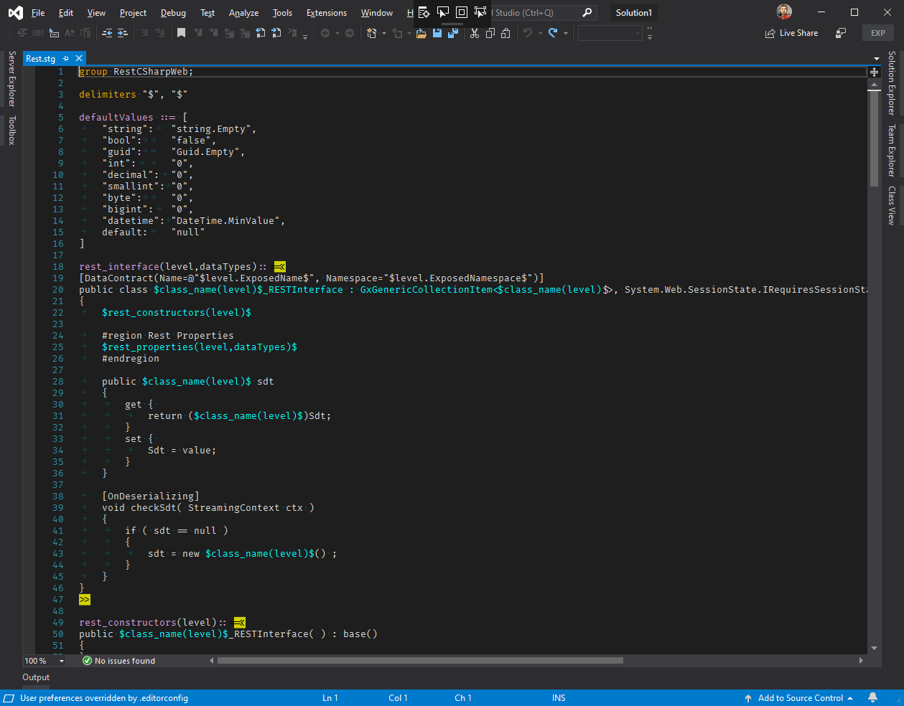

# StringTemplateColoring
Visual Studio 2019 extension that provides syntax coloring for StringTemplate 4

## This is still work in progress!

This [StringTemplate cheat sheet](https://theantlrguy.atlassian.net/wiki/spaces/ST/pages/1409038/StringTemplate+cheat+sheet) is what I'll eventually try to cover.

So far, it looks like this 👇  

